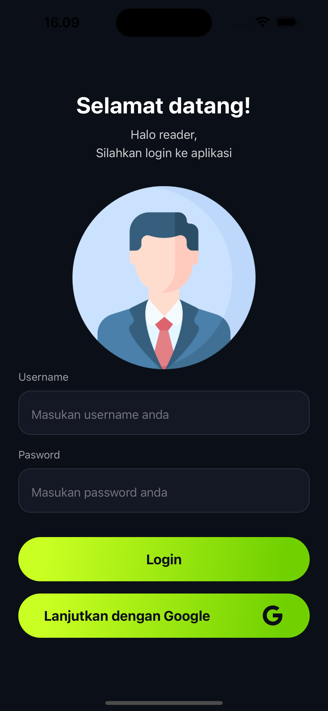
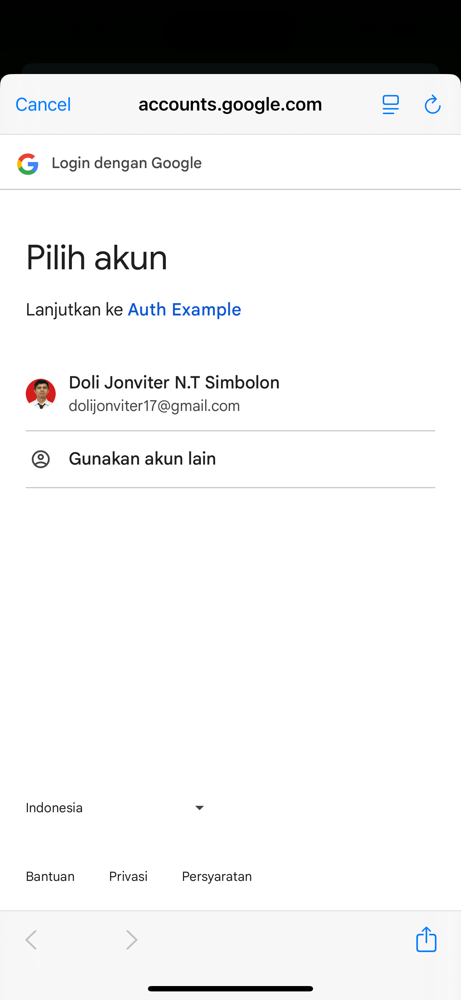
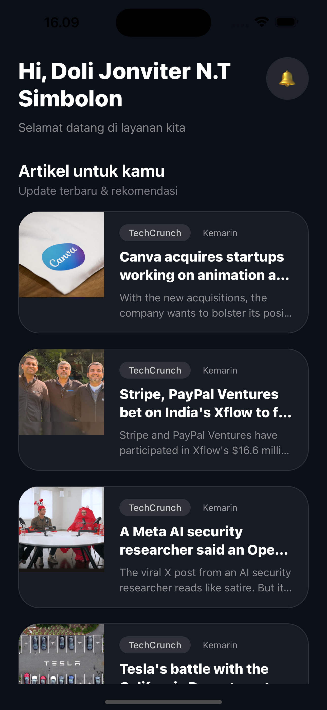
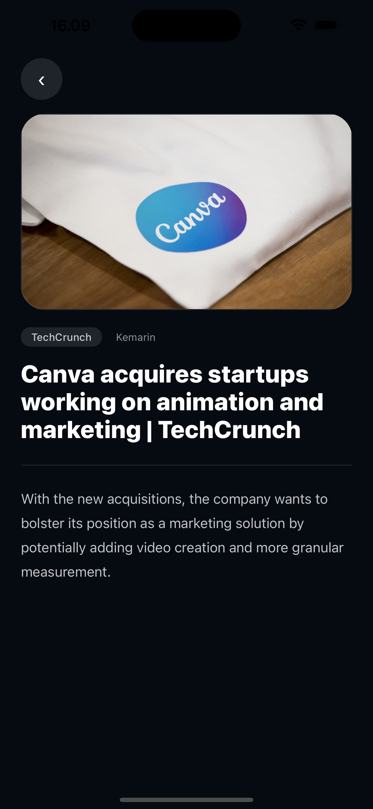
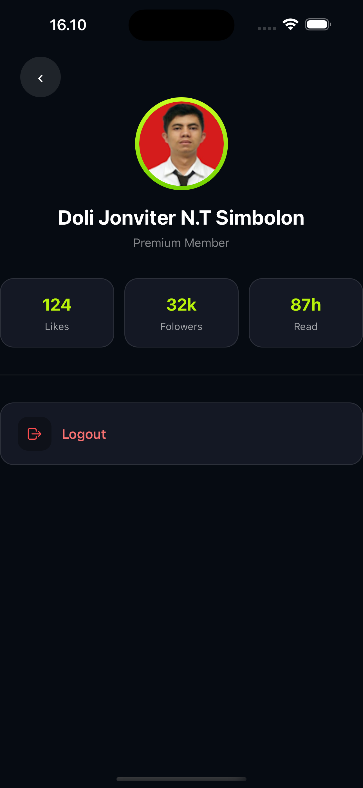

# 📰 News Reader Mobile App


A modern **React Native (Expo)** mobile application featuring authentication, Google OAuth integration, article listing, detailed article view, and user profile management.

Built with scalable architecture and clean UI design.

---

## ✨ Features

- 🔐 Email & Password Authentication
- 🔑 Google Sign-In (OAuth)
- 📰 News Article Listing
- 📄 Article Detail Screen
- 👤 User Profile Page
- 📊 User Statistics (Likes, Followers, Read)
- 🚪 Logout Functionality
- 🌙 Modern Dark Theme UI

---

## 📸 Application Preview

### 🔐 Login Screen



### 🔑 Google Authentication



### 📰 Home Screen



### 📄 Article Detail Screen



### 👤 Profile Screen



---

## 🛠 Tech Stack

- React Native (Expo)
- TypeScript
- Expo Router / React Navigation
- Google OAuth
- REST API Integration
- State Management (Redux Toolkit / Zustand)
- Axios
- EAS Build

---

## 🧠 Architecture

This project follows a **feature-based folder structure** and separation of concerns.

---

## 🔐 Authentication Flow

1. User logs in via Email/Password or Google OAuth
2. Authentication token is stored securely
3. User redirected to Home screen
4. Logout clears session and returns to Login screen

---

## 🚀 Installation

```bash
git clone https://github.com/your-username/your-repo.git
cd your-repo
npm install


---

## 📦 Download APK

You can download and install the Android APK from the link below:

👉 **[Download APK](https://drive.google.com/file/d/10kpEh2BZLQBzxjzkzAm7-Hwd_Iqjnud4/view?usp=sharing)**

> ⚠️ Make sure to enable *Install from Unknown Sources* on your Android device before installing.
```
